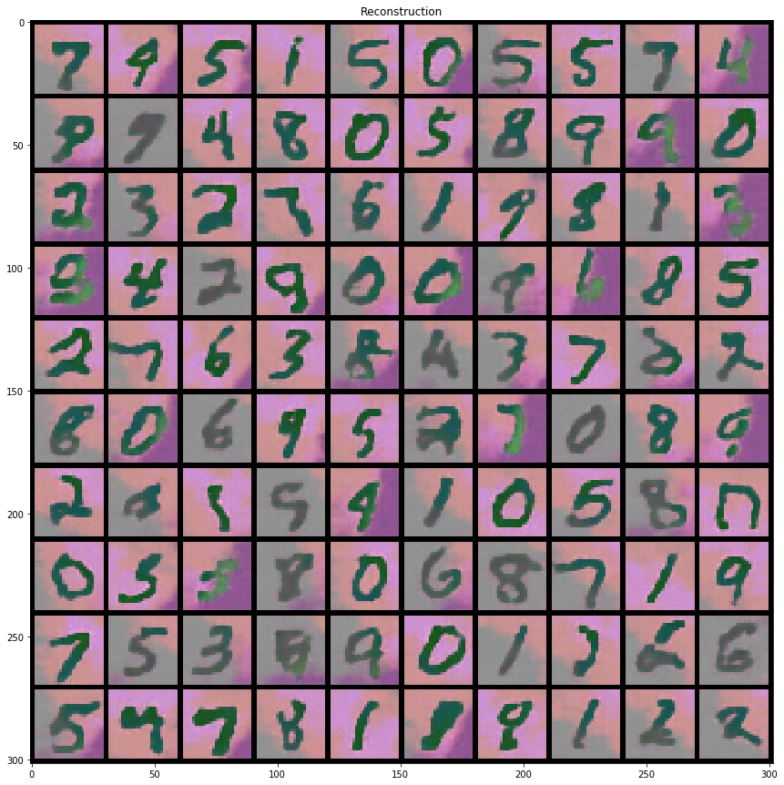

# Generativ Models and Sampling
This repository is based on the "Generativ Models and Sampling" course exercises at Heinrich-Heine University in Duesseldorf - Germany.

## exercise 1
[exercise 1](exercise_01)
- Likelihood of a distribution with two modes

## exercise 2
[exercise 2](exercise_02)
- Pixel_CNN of colored MNIST and grey MNIST

## exercise 3
[exercise 3](exercise_03)
- Pixel CNN and MADE

## exercise 4
[exercise 4](exercise_04)
- Variational Autoencoder (VAE) on distributions

## exercise 5
[exercise 5](exercise_05)
- VAE on MNIST-Grey
- GAN on Colored MNIST
- GAN on Distributions with multiple modes, which are in a cycle

# exercise 6
[exercise 6](exercise_06)
- Vector Quantized Variational Autoencoders (VQ-VAE) on grey MNIST with a GatedPixelCNN as a Prior.

## exercise 7
[exercise 7](exercise_07)
- Vector Quantized Variational Autoencoders (VQ-VAE) on colored MNIST with a GatedPixelCNN as a Prior. One with Batchnormalisation on one without.

## Results
### VQ VAE with the PixelCNN as Prior

### VQ VAE variance 
